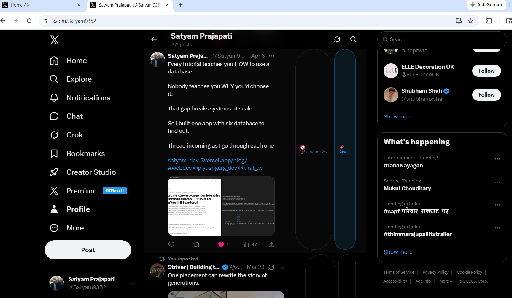
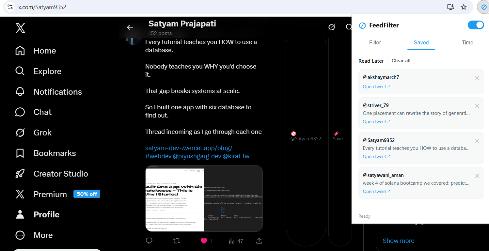
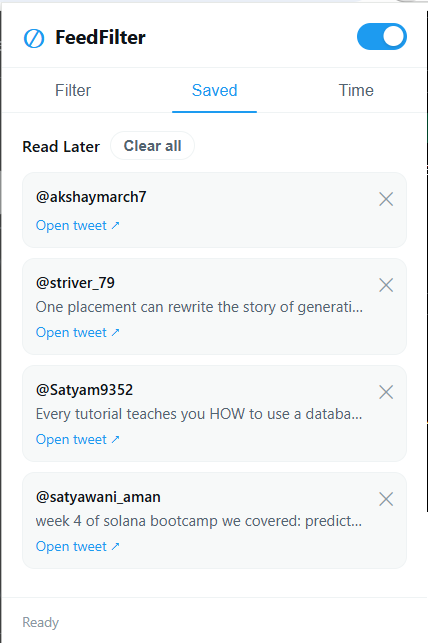
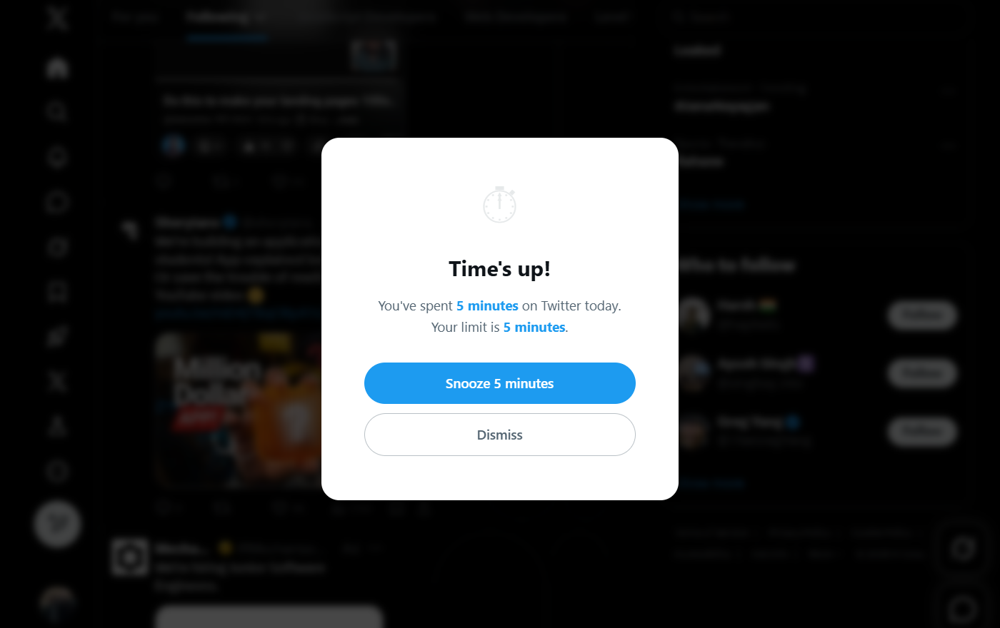
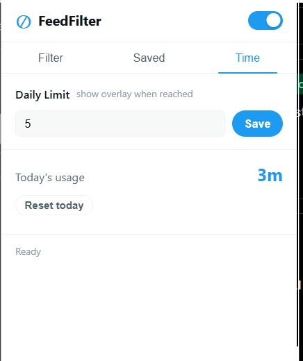

# FeedFilter — Twitter/X Feed Cleaner

> A powerful Chrome extension to take back control of your social media feed. Intelligently filter out distractions with keyword blocking, account muting, post saving, and daily time limits — all with a clean, intuitive popup interface.

**Built with:** Vanilla JavaScript · Chrome Manifest V3 · Architected for maintainability

---

## Features

- **Keyword Blocking** — Hide tweets containing specific words or phrases (case-insensitive partial matching)
- **Mute Accounts** — Silently mute annoying accounts; right-click context menu for quick muting
- **Save Posts** — Bookmark interesting tweets in a local read-later list (capped at 200)
- **Time Tracking** — Set daily time limits and track active time on Twitter/X
- **Time Limit Overlay** — Get notified when you've reached your daily limit with a dismissible overlay
- **Engagement Filter** — Hide low-engagement posts (filter by minimum likes)
- **Dark Mode Support** — Automatic light/dark theme based on system preference
- **Smart Placeholders** — Shows reasons why tweets were hidden (toggleable)
- **Sync Across Devices** — All settings sync via `chrome.storage.sync`

---

## Screenshots

### Landing UI — 3 Tabs for Complete Control


Filter keywords, mute accounts, and set time limits from one clean popup interface.

### X/Twitter Feed with FeedFilter Active


Filtered tweets show as light placeholders with reasons. Action buttons for quick muting and saving.

### Save Tweet Feature


One-click saving with visual feedback. View all saved posts in the "Saved" tab.

### Daily Time Limit Reminder


Friendly overlay notification when you hit your daily time limit.

### Time Tracking in Action


Real-time counter showing how long you've been on the platform today.

---

## Quick Start

### Installation (Local Development)

```bash
1. Open chrome://extensions in your browser
2. Enable "Developer mode" (toggle in top-right corner)
3. Click "Load unpacked"
4. Select this folder (feedfilter2/)
5. Navigate to twitter.com or x.com
6. Click the FeedFilter icon in your extensions toolbar
```

### First Run

1. **Set up filters:** Add keywords you want to block
2. **Mute accounts:** Add handles of accounts you want to silence (or use right-click context menu)
3. **Optional — Time limit:** Set a daily limit (0 = disabled)
4. **Toggle on/off:** Use the master switch in the header to pause filtering anytime

---

## Project Structure

```
feedfilter2/
├── manifest.json              # Manifest V3 extension config
├── background.js              # Service worker (alarms, message hub, context menus)
│
├── content/
│   ├── content.js             # DOM scanner & tweet filter injection
│   └── content.css            # Injected element styles (dark mode compatible)
│
├── popup/
│   ├── popup.html             # Tab UI (Filter, Saved, Time)
│   ├── popup.js               # Event handlers & state rendering
│   └── popup.css              # Popup styles (light + dark theme)
│
├── utils/
│   ├── storage.js             # Centralized chrome.storage wrapper
│   ├── filter.js              # Pure filtering logic (testable, no side effects)
│   ├── timer.js               # Time tracking utilities
│   └── messages.js            # Message type constants
│
├── assets/
│   └── icons/                 # Extension icons (16, 32, 48, 128px)
│
├── screenshot/                # Demo screenshots
└── README.md
```

---

## Architecture & Design Principles

This project demonstrates clean architecture and separation of concerns:

### 1. Centralized Storage (`utils/storage.js`)
- **Every** `chrome.storage` call goes through one module
- Makes it trivial to swap storage backends, add encryption, or handle migrations
- Single point of truth for the schema

```javascript
// All storage operations centralized
const settings = await getSettings();
await setSettings({ keywords: [...keywords, newKeyword] });
```

### 2. Pure Filtering Logic (`utils/filter.js`)
- Zero DOM manipulation, zero storage calls
- Takes immutable data and returns filtering decision
- Fully testable in Node.js without browser APIs

```javascript
// Can be tested independently
const { hide, reason } = shouldHideTweet(tweet, settings);
```

### 3. Typed Message Constants (`utils/messages.js`)
- All inter-component messages defined in one place
- Prevents typos and silent failures
- Clear documentation of message flow

### 4. Centralized DOM Selectors (`content.js`)
- Twitter CSS selectors in a single `SEL` object
- When Twitter's markup changes, update one place
- Easy to maintain and debug

### 5. Modular Content Script (`content.js`)
- Handles DOM scanning, tweet parsing, and UI injection
- Listens for settings updates and re-filters instantly
- Injects action buttons dynamically

---

## Data Flow

```
popup.js (user changes settings)
    ↓
storage.js (persist to chrome.storage.sync)
    ↓
background.js (broadcasts SETTINGS_UPDATED)
    ↓
content.js (receives update, re-scans feed)
    ↓
filter.js (applies filters, hides/shows tweets)
```

---

## Adding New Features

The modular design makes adding features straightforward:

### Example: Add a Language Filter

1. **Add to schema** (`utils/storage.js`):
   ```javascript
   DEFAULT_SETTINGS = { ..., blockedLanguages: [] }
   ```

2. **Add getter/setter** (`utils/storage.js`):
   ```javascript
   export async function addBlockedLanguage(lang) { ... }
   ```

3. **Add filter logic** (`utils/filter.js`):
   ```javascript
   function checkLanguage(tweet, blockedLanguages) { ... }
   const checks = [ ..., () => checkLanguage(...) ]
   ```

4. **Add UI** (`popup.html` + `popup.js`):
   ```html
   <input id="language-input" placeholder="e.g., Spanish">
   <button id="add-language-btn">Block</button>
   ```

5. Done! No need to modify `content.js` or `background.js`

---

## Tech Stack

| Layer           | Technology          | Why                           |
|-----------------|---------------------|-------------------------------|
| Extension       | Chrome Manifest V3  | Latest Chrome extension spec  |
| Language        | Vanilla JavaScript  | No dependencies, fast, portable |
| Storage         | chrome.storage.sync | Syncs across devices          |
| Styling         | CSS 3 + Variables   | Dark mode, responsive         |
| Testing         | Node.js compatible  | Pure filter.js is testable    |

---

## Code Quality Highlights

- No external dependencies — Pure vanilla JavaScript
- Centralized configuration — Changes in one place
- Separation of concerns — Storage, filtering, and UI are independent
- Browser API compatibility — Manifest V3 best practices
- Performant DOM queries — Debounced MutationObserver
- XSS safe — HTML escaping in all user-facing output
- Accessibility ready — Semantic HTML, ARIA labels, keyboard support
- Dark mode — CSS variables adapt to system preference

---

## Key Technical Decisions

| Decision | Rationale |
|----------|----------|
| Manifest V3 | Future-proof; Manifest V2 is deprecated |
| No frameworks | Smaller bundle, faster, easier to maintain |
| Centralized storage | Single source of truth; future-proof |
| Pure filter logic | Testable, reusable, easy to debug |
| Message constants | Type safety without TypeScript |
| chrome.storage.sync | Cross-device settings sync out of the box |

---

## Future Improvements

- Regex keyword support — Advanced users can use patterns
- Import/Export settings — Backup and share configs
- Language detection filter — Auto-hide non-English tweets
- Sentiment analysis — Hide negative/toxic content
- Statistics dashboard — Visualize filtering trends
- Scheduling — Auto-enable filters at certain times
- Browser support — Edge, Firefox extensions
- Unit tests — Jest test suite for filter.js

---

## License

MIT License — Feel free to fork, modify, and learn from this project.

---

## Contributing

This is a portfolio project, but improvements are welcome! Please:

1. Fork the repo
2. Create a feature branch (`git checkout -b feature/awesome-filter`)
3. Commit your changes
4. Push and open a Pull Request

---

## Contact & Portfolio

Built as a learning project to demonstrate:
- Chrome extension development (Manifest V3)
- Clean code architecture
- UI/UX design
- DOM manipulation & event handling
- State management (distributed across components)
- Testing-friendly code structure

Learn more about this project and my work:
- **Portfolio:** https://satyam-dev-7.vercel.app/
- **Detailed Blog Post:** https://satyam-dev-7.vercel.app/blog/i-built-a-chrome-extension-that-cleans-twitter-feed

Ready to discuss architecture decisions, implementation details, or extend functionality.
